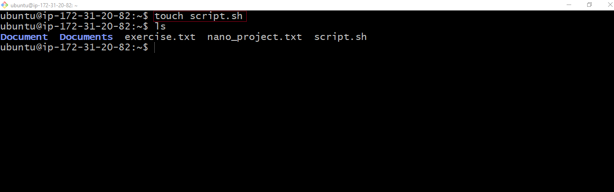
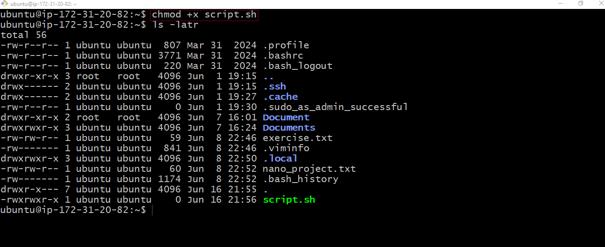
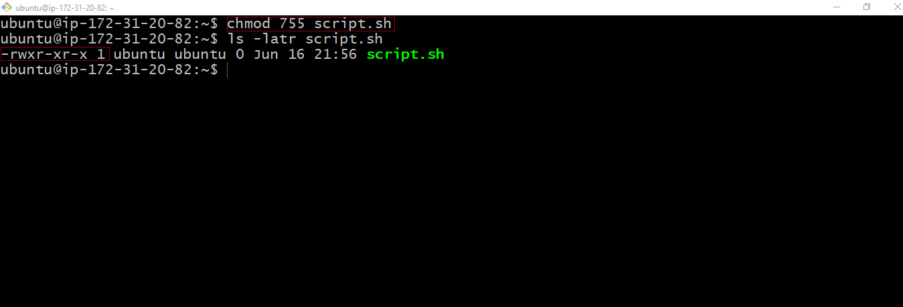
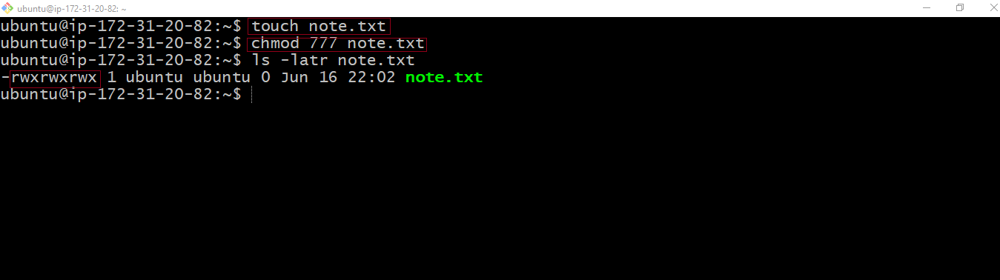

# File Permission Commands
#
To manage file permissions and ownership, Linux provides several commands:

## `chmod` command
The `chmod` command allows you to modify file permissions. You can use both symbolic and numeric representations to assign permissions to the user, group, and others.
Create an example file using the `touch` command
```
touch script.sh
```
Check the permission of file:
```
ls -latr script.sh
```




Update the permission so that all user classes will have execute permission
```
chmod +x script.sh
```



The above command uses the `chmod` command with the `+x` option to grant execute permission to the file `script.sh`. The `+x` option adds the execute permission to the existing permission for all the user classes.
See what file permissions look like:
```
ls –latr script.sh
```
The same command can be executed to achieve the same result using the numbers approach:
```
chmod 755 script.sh
```



To add execute permission for all (user, group, others), you would add 1 to each of the three categories, resulting in 755:
* (4+2+1) = 7 for the user (read, write, and execute),
* (4+1) = 5 for the group (read and execute),
* (4+1) = 5 for others (read and execute).

Let’s consider another example, imagine the owner of a file is currently the only one with full permissions to `note.txt`.
To allow group members and others to read, write, and execute the file, change it to the `-rwxrwxrwx` permission type, whose numeric value is 777:
```
chmod 777 note.txt
```
To confirm output:
```
Ls –latr note.txt
```


#

## `chown` command

The `chown` command allows you to change ownership of files, directories, or symbolic links to a specified username or group.
Here is the basic format:
```
chown [option] owner[:group] file(s)
```

For example, let’s assume there is a user on the sever called “john”, a group called “developers” and you want the owner of `filename.txt` changed from “dare” to “john”, and to also ensure that any user in the developer group has ownership of the file as well:
The command would look like:
```
chown john:developer filename.txt
```
To confirm output:
```
ls –latr filename.txt
```

## Superuser Privileges
It is often necessary to become the superuser to perform important tasks in linux, but as we know, we should not stay logged in as the superuser. In most linux distributions, there is a command that can give you temporary access to the superuser privileges. The program is called `sudo` (short for super user) and can be used in those cases when you need to be the superuser for a small number of tasks. To use the superuser privileges, simply type `sudo` before the command you will be invoking.
To switch to the root user, simply run:
```
sudo –i
```
You can type `exit` to leave the shell

## User Management on Linux
As a DevOps engineer, you are also going to be doing systems administration which involves managing different users on the servers. You should know how to create a new user, or group, modify their permissions, update password and such similar tasks.

### Creating a user
To create a new user on Ubuntu Server, you can use the `adduser` command. Assuming the name of user to be created is ‘joe’. Open the terminal and run the following command:
```
sudo adduser johndoe
```
Running this command will prompt you to enter and confirm a password for the new user. You will also be asked to provide some additional information about the user, such as their full name and contact information. Once you provide the necessary details, the user account will be created, and a home directly will be automatically generated for the user.
The home directory represents a file system directory created in the name of the user. Such as `/home/johndoe`. This is where each user created on the server will store their respective data.

### Granting Administrative Privileges
By default, newly created user accounts do not have administrative privileges. To grant administrative access to a user, you can add the user to the sudo group. Users in the sudo group can run commands with administrative privileges. To the `johndoe` user to the sudo group, run:
```
sudo usermod –aG sudo johndoe
```
* `usermod`: This is a command that modifies user account properties.
* -aG : These are flags used with the usermod command.
	* -a stands for “append” and is used to add the user to the specific group(s) without removing them from other groups they may already belong to.
	* -G stands for “supplementary groups” and is followed by a comma-separated list of groups. It specifies the groups to which the user should be added or modified.
* In the given command, `-aG sudo` is used to add the user `johndoe` to the sudo group.
* The sudo group is typically associated with administrative or superuser privileges. By adding `johndoe` to the `sudo group, the user gains the ability to execute commands with elevated privileges.
Switching User Accounts
To start using the system as another user, you will need to use the `su` command to switch.
To switch to another user account, use the `su` command followed by the username. For example, to switch to the johndoe account, run:
```
su johndoe
```
You will be prompted to enter the password for the user. Once authenticated, you will switch to the user’s environment.

### Modifying User Accounts
Changing User Password
To change the password for a user , use the `passwd` command followed by the username. For example, to change the password for `johndoe`, run:
```
sudo passwd johndoe
```
You will be prompted to enter and confirm the new password for the user.

### Creating a Group
To create a new group, use the `groupadd` command. For example, to create a group named “developers”, use:
```
sudo groupadd developers
```

### Adding Users to the Group
Use the `usermod` command to add users to the group. For instance, to add users “john” and “jane” to the “developers” group:
```
sudo usermod –aG developers johndoe
```
* The `-aG` option append the “developers” group to the existing group memberships. 
Verifying Group Memberships
To confirm the group memberships for a specific user, use the `id` command. For example, to check the group memberships for the user “johndoe”;
```
id johndoe
```
This command displays information about the user “johndoe”, including the groups they belong to, such as “developers”.

### Deleting a User
To delete a user, run the command below:
```
sudo userdel username
```

### Ensuring Proper Group Permissions
Groups in Linux are often used to manage permissions for the files and directories. Ensure that the relevant files or directories have the appropriate group ownership and permissions. For example, to grant the “developers” group ownership of directory:
```
sudo chown :developers /path/to/directory
```
And to grant read and write permissions to the group:
```
sudo chmod g+rw /path/to/directory
